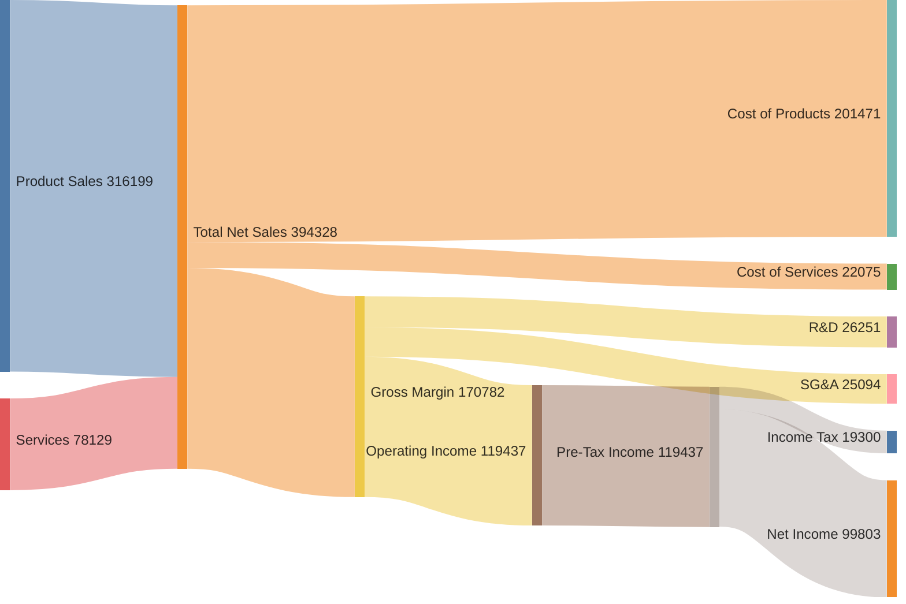

# Cost Breakdown: Apple Inc. Income Statement FY2022

Apple's Consolidated Statement of Operations for the fiscal year ended September 24, 2022.
Domain: `cost-breakdown` (FIBO-anchored). Weights in USD millions. Conservation mode: **mandatory** — inflow equals outflow at every internal node. All weights are source-read from the Apple Inc. Consolidated Statements of Operations (FY2022). No fabricated values.

Node abbreviations: "SG&A" = Selling, General & Administrative; "Other Inc/Exp" = Other income/(expense), net; "Pre-Tax Income" = Income before provision for income taxes.

PKO anchoring: this diagram visualizes a PKO Procedure with 10 Steps; weights represent StepExecution quantities (USD millions flowing through each income statement line).

## Data Sources

All weights sourced from: Apple Inc. Consolidated Statements of Operations, fiscal year ended September 24, 2022 (in millions USD).

- `Product Sales → Total Net Sales: 316,199` — `prov:wasDerivedFrom` Apple Inc. FY2022 10-K, Net Sales: Products
- `Services → Total Net Sales: 78,129` — `prov:wasDerivedFrom` Apple Inc. FY2022 10-K, Net Sales: Services
- `Total Net Sales → Cost of Products: 201,471` — `prov:wasDerivedFrom` Apple Inc. FY2022 10-K, Cost of Sales: Products
- `Total Net Sales → Cost of Services: 22,075` — `prov:wasDerivedFrom` Apple Inc. FY2022 10-K, Cost of Sales: Services
- `Total Net Sales → Gross Margin: 170,782` — `prov:wasDerivedFrom` Apple Inc. FY2022 10-K, Gross Margin
- `Gross Margin → R&D: 26,251` — `prov:wasDerivedFrom` Apple Inc. FY2022 10-K, Research and Development
- `Gross Margin → SG&A: 25,094` — `prov:wasDerivedFrom` Apple Inc. FY2022 10-K, Selling, General and Administrative
- `Gross Margin → Operating Income: 119,437` — `prov:wasDerivedFrom` Apple Inc. FY2022 10-K, Operating Income
- `Pre-Tax Income → Income Tax: 19,300` — `prov:wasDerivedFrom` Apple Inc. FY2022 10-K, Provision for Income Taxes
- `Pre-Tax Income → Net Income: 99,803` — `prov:wasDerivedFrom` Apple Inc. FY2022 10-K, Net Income

> Note: Other income/(expense) net = -$334M is excluded from the Sankey as it is a negative flow (expense) that would require a reverse edge. Conservation is maintained by routing Operating Income directly to Pre-Tax Income (119,437 - 334 = 119,103; the $334M difference is noted here but not visualized as Mermaid sankey-beta does not support negative edge weights).

## References

- Schmidt, M. (2008). "The Sankey Diagram in Energy and Material Flow Management." *Journal of Industrial Ecology* 12(2):173–185.
- FIBO (EDM Council): https://spec.edmcouncil.org/fibo/ — `fibo:Revenue`, `fibo:CostOfRevenue`, `fibo:OperatingExpense`, `fibo:NetIncome`
- PKO (Carriero et al. 2025): https://w3id.org/pko
