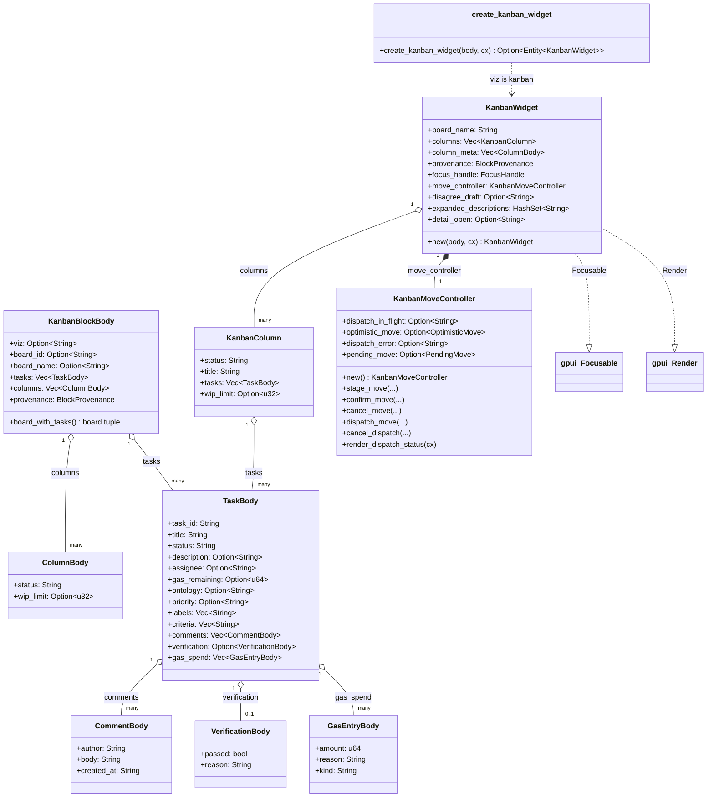

# hKask Kanban Widget — Class Diagram

`hkask-kanban-widget` renders ` ```kanban ` fenced blocks as a horizontal
column layout (Backlog → Ready → In Progress → Review → Done). It is a passive
renderer: the data comes from the parsed `KanbanBlockBody` (JSON already in the
chat stream, mirroring the combined `kanban_board_list` + `kanban_task_list`
tool responses), not from live MCP fetches. Read-only — task moves are done by
the agent calling `kanban_task_move` directly.



**Block shape:** a JSON body with `viz: "kanban"` and a single board
(`board_id` + `board_name` + `tasks`). The agent emits one block per board
when multiple boards are needed. `board_with_tasks()` returns the
`(board_id, board_name, tasks)` tuple, defaulting the name to the id or
`"Kanban Board"` when both are absent.

**Column grouping:** `group_tasks_into_columns` buckets tasks by
lowercased `status`, emits the five standard columns in order (attaching WIP
limits from `column_meta`), then appends any non-standard statuses sorted
alphabetically (title-cased).

**Move lifecycle (S9):** `KanbanMoveController` owns the dispatch state
machine (`pending_move`, `dispatch_in_flight`, `dispatch_error`,
`optimistic_move`). `KanbanWidget` delegates move lifecycle calls to it. The
controller's `render_dispatch_status` renders the Confirm/Cancel/Evaluate
banner and calls back into the widget's `evaluate_move` for the Evaluate path.

**Card detail (B3):** `detail_open` holds the task id whose detail popover is
open. The popover renders the full task (description, criteria, comments,
verification, gas spend log) passively from the block body.

<!-- DIAGRAM_ALIGNMENT
id: DIAG-VIZ-KANBAN
verified_against: crates/hkask-kanban-widget/src/block.rs; crates/hkask-kanban-widget/src/view.rs; crates/hkask-kanban-widget/src/move_controller.rs
status: STALE
note: Fields synced to B3 (TaskBody: comments/verification/gas_spend + CommentBody/VerificationBody/GasEntryBody), S8 (KanbanBlockBody: columns/ColumnBody + KanbanColumn: wip_limit), S9 (KanbanMoveController extracted; KanbanWidget: move_controller/detail_open/column_meta). Method bodies and render-tree relationships not re-verified.
-->
