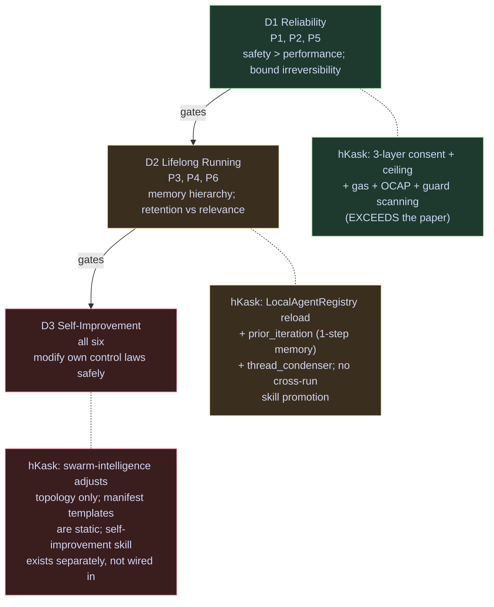
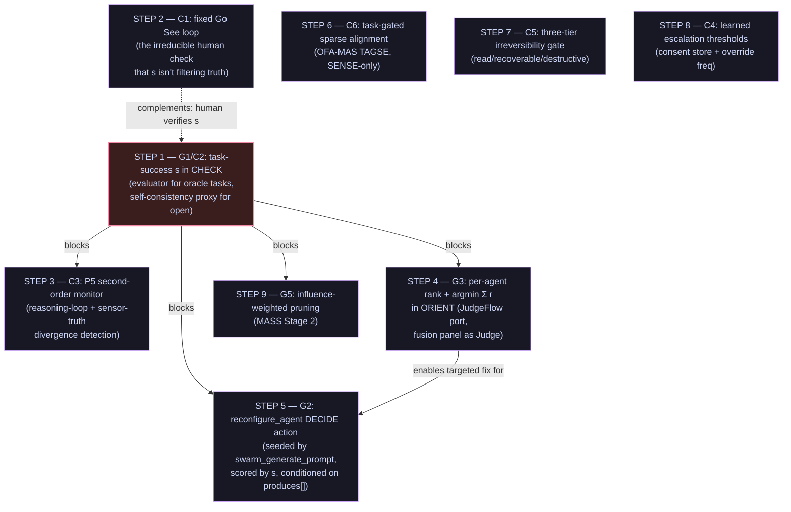

# Cybernetic Swarm Plan — Reference Model, Map, and Findings

> Companion to `abw-swarm-intelligence.md`. That document is the
> **current-state** substrate (ABW semantics, tool surface, consent gate). This
> document is the **cybernetic frame** layered on top: how the six canonical
> cybernetic laws, the human-on-the-loop steering model, and the Toyota
> Improvement Kata compose with the `swarm-intelligence` skill and its consent
> gate. Every hKask claim below is grounded in the cited code paths or plan-doc
> sections; the two external sources are cited by URL and quoted where
> load-bearing. When this document disagrees with the code, the code wins.
>
> **Status:** reference + findings, 2026-08-02. Not yet implemented — the
> findings (§7) are proposals ranked by leverage, with implementation
> sequencing in §8 governed by the dependency hierarchy (§3).

## 0. Sources and reference models

### 0.1 External sources (read in full)

| # | Source | URL | Role in this plan |
|---|---|---|---|
| S1 | Wang, Yang et al., *The Agent Use of Agent Beings: Agent Cybernetics Is the Missing Science of Foundation Agents* (arXiv:2605.10754v1, 11 May 2026) | https://arxiv.org/html/2605.10754v1 | Agent-internal cybernetics: 6 laws → 6 principles → 3 desiderata |
| S2 | Lässig, *Cybernetics and the "human-on-the-loop" in agentic coding* (ThoughtWorks, 20 Apr 2026) | https://www.thoughtworks.com/en-us/insights/blog/generative-ai/cybernetics-and-human-on-the-loop-in-agentic-coding | Human-external cybernetics: Ashby variety → meta-level steering → Go See |
| S3 | *SwarmAgentic* (arXiv:2506.15672) | https://arxiv.org/abs/2506.15672 | Population search over system structures; task-success objective `J(S)` |
| S4 | *HyEvo* (arXiv:2603.19639) | https://arxiv.org/abs/2603.19639 | Heterogeneous LLM+code nodes; multi-island evolution; reward `R(𝒢)` |
| S5 | *JudgeFlow* (arXiv:2601.07477, ICML 2026) | https://arxiv.org/abs/2601.07477 | Block judge; responsibility score `B_sel = argmin Σ r_k`; re-prompt action |
| S6 | *OFA-MAS / OFA-TAD* (arXiv:2601.12996, WWW 2026) | https://arxiv.org/abs/2601.12996 | Learned topology generator; task-aware sparse-gating encoder (TAGSE) |
| S7 | *Multi-Agent Design / MASS* (arXiv:2502.02533, ICLR 2026) | https://arxiv.org/abs/2502.02533 | Three-stage interleaved optimization: prompts → topology → prompts |

S1 and S2 are the **frame**; S3–S7 are the **prior deep-reads** whose findings
this plan reframes cybernetically (see §6).

### 0.2 The cybernetic lineage (S1 §2, S2)

- **Wiener** (1940s): feedback and control in complex systems; the feedback
  principle `u(t) = K(r(t) − y(t))`.
- **Ashby** (1956): *Law of Requisite Variety* — "Only variety can absorb
  variety"; `V(R) ≥ V(E)` for complete control.
- **Cannon / Ashby**: homeostasis — maintain essential variables in a viability
  region `Ω` despite perturbations; **ultrastability** = two-level architecture
  (fast inner loop preserves `Ω`; slow outer loop restructures `Ω`).
- **Conant-Ashby theorem** (S2): "Every good regulator of a system must be a
  model of that system."
- **Von Foerster**: second-order cybernetics — the observer is in the system;
  `R': H → K(R)` — a second-order regulator acts on the space of first-order
  regulators.
- **Shannon-Wiener**: channel capacity — `I_corrective ≤ C_channel`; residual
  output entropy `H(output) ≥ H(E) − C_channel`.
- **Stafford Beer** (1970s): Viable System Model (VSM) — cybernetics applied to
  management/organization viability.
- **Malik** (1980s, St. Gallen School): *meta-systemic steering* — the
  manager/human steps to the meta level because operative-level variety
  exceeds human cognition.
- **Toyota / Lean**: *Gemba*, *Genchi Genbutsu* ("Go See") — descend to the place
  value is created to verify steering is connected to reality; double-loop
  learning. The **Improvement Kata** (Rother 2010) is the 4-step scientific
  thinking loop the hKask `swarm-intelligence` skill instantiates.

### 0.3 The Kata/Kanban mapping (the user's frame)

- The hKask `swarm-intelligence` skill **is an Improvement Kata**:
  SENSE (grasp current) → ORIENT (establish target / classify gap) → DECIDE
  (predict) → ACT (experiment) → CHECK (measure) → CONVERGE (check + act).
- The hKask consent gate **is a Kanban pull-system for credits**: the operator
  mints a consent token only when ready to spend (= pull); the per-dispatch
  ceiling (`HKASK_ABW_MAX_CREDITS`) is the WIP limit on spend.
- The `metacognition` skill (`kask/registry/manifests/metacognition.yaml`) is
  the Kata applied to the agent's own map-building — same four steps, with a
  deterministic gap + Brier convergence compute. This plan was produced using
  that skill's methodology (see §9.2 for the honest metacognitive record).

## 1. The single cybernetic argument (S1 + S2 compose)

The two frame sources are **not parallel** — they compose into one argument:

- **S1 (Agent Cybernetics)** = the **agent-internal** control architecture.
  Six laws → six agent principles → three desiderata (Reliability, Lifelong
  Running, Self-Improvement). The human appears at exactly one seam: P3 outer
  loop "escalating to a human overseer for clarification" (S1 §3.1 Principle 3)
  and §4.1 "Human-in-the-Loop Approval" — *"checkpoints at which the agent
  pauses before executing high-risk actions … research challenges include
  determining which actions warrant escalation without making human oversight a
  bottleneck … learning escalation thresholds from operator feedback over
  time."*
- **S2 (ThoughtWorks)** = the **human-external** steering architecture. Ashby's
  requisite variety → the human steps to the meta level ("on-the-loop") because
  operative-level variety exceeds human cognition. Steering via two mechanisms:
  **attenuation** (aggregate/filter so the human isn't overwhelmed) and
  **amplification** (encode policy into the agent). Conant-Ashby: the human must
  hold a model of the system. **Go See / Gemba**: the human periodically descends
  to the operative level to verify the sensor isn't filtering out the truth =
  double-loop learning.

**The seam:** S1's "escalate to human overseer" (P3 outer loop, §4.1 approval
gate) **is** S2's "human-on-the-loop." S1 says *when* the agent should hand
control to the human (boundary of competence, high-risk action); S2 says *how*
the human receives and acts on that handoff without becoming the bottleneck
(variety attenuation/amplification) and *how* the human verifies the handoff
itself is calibrated (Go See).

## 2. The six principles × hKask swarm substrate

Every hKask surface below is verified against the manifest
(`kask/registry/manifests/swarm-intelligence.yaml`), the runtime
(`kask/mcp-servers/hkask-mcp-swarm/src/local_runtime.rs`), or the substrate
plan (`abw-swarm-intelligence.md`).

| # | Principle (S1) | Paper's prescription | hKask surface (verified) | Status | Gap |
|---|---|---|---|---|---|
| **P1** Closed-loop feedback | Discrete structured feedback causally upstream of next action; harness mandates acknowledgment before re-plan (S1 §3.1) | `swarm-intelligence` CHECK re-fetches workspace+wallet post-ACT; `delegate` tool loop appends tool results as next-round context (`local_runtime.rs` L596–603); CONVERGE consumes CHECK before LOOP routes `next_focus` back to SENSE (manifest L255–266) | **Has** | The skill's feedback IS causally upstream. Strong fit. |
| **P2** Requisite variety | `min(V(O),V(I)) ≥ V(W)`; hierarchical tool org; **escalation decisions are part of V(O)** (S1 §3.1) | `LocalAgentCard.capabilities.mcp_tools[]`/`skills[]` = V(O); the consent gate's *refusal* (`PaymentRequired`, ceiling exceeded) is an escalation decision = V(O) output; `LazyToolRouter` filters MCP tools to avoid floods = hierarchical compression | **Has** | S1's "selection cost" (large V(O) forces capacity spent navigating own state) is exactly what `LazyToolRouter` addresses. Fit is clean. |
| **P3** Goal homeostasis, two-level | Inner loop: re-inject original task every k steps, boundary monitors; **outer loop: restructure goal or escalate to human** (S1 §3.1) | `task` passed to SENSE/ORIENT/DECIDE/ACT via `input_mapping` (manifest L130–214) = inner-loop re-injection ✓. **Algedonic override**: 402 / un-acknowledged curator dispatch escalates regardless of `d` (manifest L35–37, L280) = outer-loop escalation ✓ | **Partial** | **No explicit goal-drift boundary monitor.** S1's R-CG2/R-AR2 pattern: classify each requirement done/in-progress/broken; if `m` consecutive checkpoints report the same broken invariant, trigger outer loop. hKask's CONVERGE checks Cauchy on `d`, not goal-drift similarity `sim(q_t, Q) < δ_drift`. The algedonic fires on a *payment* signal, not a *goal-drift* signal. |
| **P4** Black-box environment modelling | Treat prior knowledge as falsifiable; low-cost probes before consequential actions; treat errors as informative (S1 §3.1) | ABW treated as black box — `abw-swarm-intelligence.md` §0 "API surface (verified live)" + the `swarm_hire` two-phase consume pattern (consume cost=0 to validate scope+single-use, then re-verify real cost vs ABW, refund on failure — `hkask_mcp_swarm.rs` L1356–1420) IS exploratory probing before spend | **Has** | The two-phase consent consume is a textbook P4 probe-then-act. Strong fit. |
| **P5** Second-order agent regulation | Monitor own inferential process: loop detection, declining confidence, reasoning inconsistency; **confidence-gated escalation to human**. S1 §5.4: *"P5 meta-cognitive monitoring as the highest-value, lowest-cost intervention across all three domains"* | CONVERGE's Cauchy criterion detects *iterate stabilization* (`next_focus` stops changing) = loop detection at the swarm level. The fusion panel (`kask.fusion.panel_models`) exists but is **not wired as a second-order monitor** | **Gap (S1's headline finding)** | S1 §5.4 verdict applies directly: *"P5 is most consistently absent from current systems … low-cost to implement (statistical functions over the action log), expected benefit high."* hKask detects *swarm-state* loops (Cauchy) but not *curator-reasoning* loops (repeated hire→fire→hire→fire, declining output quality, citation cycling). The fusion panel is the unused monitor asset. |
| **P6** Context entropy minimization | Retain content iff it increases `I(a_t; goal | c_t)`; active compression, principled forgetting (S1 §3.1) | Within-skill: CONVERGE feeds only `next_focus` + `lessons_learned` back (compressed ✓). Within-`delegate`: tool-loop appends results as raw user messages across `MAX_TOOL_ROUNDS` (NOT compressed); `executed_skills`/`tool_calls` summaries are returned to the caller, not fed back into the loop | **Partial** | S1 P6: raw interaction history has high entropy / low predictive value; a structured summary carries more mutual information. hKask's summaries are the right shape but aren't compressed into the next round's context. |

## 3. The three desiderata × hKask (the dependency hierarchy)

S1 Appendix A.3 is load-bearing: **Reliability gates Lifelong Running gates
Self-Improvement** (strict, not independent). hKask's swarm layer maps cleanly
onto D1, partially onto D2, weakly onto D3.



| Desideratum | Primary principles | hKask realization | Status |
|---|---|---|---|
| **D1 Reliability** | P1, P2, P5 | 3-layer consent gate + per-dispatch ceiling + gas + OCAP (the spend membrane, `abw-swarm-intelligence.md` §3.6). `swarm_fire` = no-credit roster removal (recoverable); `swarm_delete_agent`/`swarm_delete_swarm` = destructive, gated. Guard scanning = redact-and-continue (graceful, non-fatal). | **Strong** — hKask *exceeds* S1 here; S1's §4.1 "human approval gates" is hKask's consent gate; S1's CLI irreversibility triad {read, recoverable, destructive} maps onto hKask's read/list vs hire/delegate vs delete. |
| **D2 Lifelong Running** | P3, P4, P6 | `LocalAgentRegistry` reloads from disk (episodic cards, `local_registry.rs` L131); the skill's `prior_iteration` = 1-step memory; `thread_condenser` hook exists. No semantic/procedural promotion across swarm runs. | **Partial** — single-iteration memory; no cross-run skill promotion (S1's R-CG3: "promote resolved bug classes to skill library after validation on ≥2 held-out instances"). |
| **D3 Self-Improvement** | all six | The `swarm-intelligence` skill adjusts *composition* (topology) but not *its own control laws* — the manifest's SENSE/ORIENT/DECIDE templates are static. The `self-improvement` skill exists separately (per the skills catalog) but is not wired into swarm-intelligence. | **Gap** — the swarm does not improve its own improvement procedure (recursive self-improvement, which S1 §4.3 flags as the hardest open problem). |

## 4. The human-on-the-loop mechanisms × hKask (S2)

| S2 mechanism | Cybernetic law it instantiates | hKask surface | Status |
|---|---|---|---|
| **Attenuation** (aggregate/filter so the human isn't overwhelmed) | Ashby: human variety < system variety → filter | `with_wallet` (balance rides every tool response, `abw-swarm-intelligence.md` §4.1) — a single scalar, not 200 logs. `render_consent_banner` + `within_budget: false` disables Confirm (§3.6) — the spend signal is reduced to one boolean. The algedonic channel *only* escalates on 402/un-ack, not on every dispatch. | **Has** — hKask already attenuates. The banner is textbook variety attenuation: the human sees one boolean, not the cost breakdown. |
| **Amplification** (encode policy into the agent) | Conant-Ashby: human's model amplified into agent's policy | **Steer system prompt** (§15.5): "names both tool sets, the current mode, the consent gate, the ceiling, and the `swarm-intelligence` skill." `.rules` + `AGENTS.md` + `DIVERGENCE.md` = the human's model encoded into every agent session. `kask.swarm.curator_consent_default: false` = a policy encoded as a setting. | **Has** — the Steer prompt IS amplification. The `.rules` "Convention priors must be verified against the codebase" trap is the Conant-Ashby discipline operationalized: a `.rules` entry is the human's model; `grep` verifies it against reality; a stale rule is model drift detected by verification. |
| **Conant-Ashby modeling** ("every good regulator must be a model of the system") | The human must hold a working model; model drift = steering failure | `abw-swarm-intelligence.md` (the verified-live API ledger, §0 response shapes, §17 endpoint ledger) IS the human's model of the swarm substrate. The "verified live 2026-08-02" annotations are model-freshness timestamps. | **Has** — and the plan doc's discipline of re-verifying endpoints live IS the Conant-Ashby update loop. |
| **Go See / Gemba** (descend to operative level; verify sensor isn't filtering truth; double-loop learning) | Reverses attenuation; the human's technical intuition is the ultimate sensor | **Steer mode `ConversationView`** (§15.5) is the descend surface — the human talks to the curator at the problem-solution level. | **Partial — and this is the key gap (see §5).** |

## 5. The Go See gap (the double-loop finding)

S2 is explicit and load-bearing (quoted verbatim):

> *"Sensors attenuate variety through aggregation and filtering and 'Go See'
> deliberately reverses this; the human steps back into reality … LLMs can
> produce code that looks right and pass unit tests and fulfill basic
> requirements, but may introduce decay or contain hallucinations sensors
> won't flag … Calibrating the steering ensures the sensors aren't filtering
> out the truth, and that the guides are actually having the intended effect in
> the code. 'Go See' is a corrective; it should be a fixed feedback loop in the
> 'Human-on-the-loop' system. It's actually an application of double loop
> learning."*

Read cybernetically against hKask: **`d` (the convergence metric) is a sensor
that attenuates variety.** It reduces the full swarm state to three numbers
(variety_coverage, diversity, loop_closure). A swarm with `d = 0` (perfect
variety, diversity, loop closure) can still fail the task. **The sensor is
filtering out the truth — task failure — exactly the failure mode S2 names.**

This **reframes** the prior five-paper deep-read's headline finding (G1: "hKask
optimizes swarm-health `d`, not task-success"). It is not merely "wrong objective
function." It is the cybernetic diagnosis S2 predicts: **a sensor designed for
attenuation (swarm-health) filters out the signal a human would catch by
descending (task-failure).** S2's prescribed remedy — Go See as a *fixed
feedback loop* — is the human-in-the-loop mechanism that compensates for a
sensor that cannot, by Ashby's law, carry the full variety of task success.

### 5.1 Why Go See cannot be fully automated (the cybernetic bound)

The prior five papers (S3–S7) all attempt to *automate* the Go See signal:

- S3 SwarmAgentic: `J(S)` task-success on a training set.
- S4 HyEvo: `R(𝒢) = λ1·S + λ2·U_c(C_q) + λ3·U_t(T_q)`.
- S5 JudgeFlow: `φ_eval(a'_M, a)` against ground truth `a`.
- S6 OFA-MAS: task accuracy on 6 benchmarks (Stage-3 fine-tuning).
- S7 MASS: `E_D` on a held-out sample.

Every one of them hit the same blocking unknown: **`a`, the ground-truth
answer**, on open-ended tasks. S1's P6 (Shannon-Wiener channel capacity) is the
formal reason: `H(output) ≥ H(E) − C_channel`. No automated sensor can carry the
full variety of "is this actually right" — the channel is finite. **The
cybernetic argument implies Go See cannot be fully automated away; the best the
swarm can do is reduce the *frequency* of descents by improving the sensor, not
eliminate them.** The five papers' evaluators reduce descent frequency; S2's
Go See is the irreducible human check that the upgraded sensor still isn't
filtering truth.

**The complete design:** upgrade `d` with a task-success term (automate part of
Go See) **AND** schedule a fixed Go See feedback loop (the irreducible human
check). They are complements, not alternatives.

## 6. The five prior deep-reads, reframed cybernetically

| Paper | Mechanism | Cybernetic principle it automates | hKask gap it points at | Portable? |
|---|---|---|---|---|
| **S3 SwarmAgentic** | Population `N=5`, pbest/gbest, `LLM_flaw` system-wide diagnosis, `J(S)` task-success | P1 (closed loop over candidates) + P5 (flaw diagnosis) + D1 objective | G1 (no task-success `s`) | Partial — population search is expensive under the consent gate (each candidate hire needs a token); better for the Steer curator than the automated cascade |
| **S4 HyEvo** | Heterogeneous LLM+code nodes, multi-island MAP-Elites, `R(𝒢)` tri-objective, reflect-then-generate over failure logs | P1 + P5 (reflect over `L_parent`) + P6 (code nodes reduce context entropy) | G2 (prompt/node-logic axis frozen) + C3 (no second-order monitor) | Partial — `compute_ref` is a closed registry (the pattern HyEvo rejects); `lisp.eval` is operator-authored not synthesized. The 19×/16× cost/latency gain needs code nodes hKask lacks. |
| **S5 JudgeFlow** | Block judge, `B_sel = argmin Σ r_k^{(t)}`, Modify Block (re-prompt), greedy top-1 focus | P5 (per-agent blame) + G2 (re-prompt action) | G3 (ORIENT emits deficit class, not per-agent rank) + G2 (no Modify action) | **Yes (cleanest port)** — formula `B_sel = argmin_{B_k} Σ_{t=1}^T r_k^{(t)}` (S5 §3.2.1 L293) is a sum + argmin; the Judge prompt (S5 App.C L697–719) adapts directly ("block" → "agent"); the fusion panel is the unused judge asset. Blocking unknown: ground-truth `a` / failure predicate `s < ε`. |
| **S6 OFA-MAS** | TAGSE task-gated sparse-gating encoder, MoE learned generator, Stage-3 outcome fine-tuning | P2 (task-gated variety) | C2 (task-gated alignment in SENSE) | **One portable idea** — TAGSE's task-gated sparse edge relevance in SENSE's `alignment` (structural port, no training). The learned generator, the 16 experts, the 19-role pool, Stage-3 outcome feedback are NOT portable (no training infra; closed pool incompatible with open `agent_type`; output format weaker than `LocalAgentCard`). |
| **S7 MASS** | Three-stage interleaved: block-level prompt opt → topology → global prompt opt; influence-weighted rejection sampling | P3 (interleaved goals) + G2 (prompt axis) | G2 (prompt axis frozen) + G1 (no task-metric `E_D`) | Partial — Stage 1 (MIPRO prompt opt) and Stage 3 (global joint) are the prompt axis hKask lacks. A `reconfigure_agent` DECIDE class is only well-founded if it carries (i) validation metric `E_ai`, (ii) candidate generator `M×K`, (iii) conditioning on upstream `produces[]` — otherwise it's theatrical (the `.rules` "Advertised invariants need enforcement points" trap). |

**The convergent finding across S3–S7 + S1 + S2:** four of the five papers
optimize **task-success against an evaluator**; hKask's `d` optimizes
**swarm-health**. This is the precondition for faithfully porting any of the
four mechanisms. S2 explains *why* it's hard to fix: by Ashby, no automated
sensor carries the full variety of task success — Go See is the irreducible
human check.

## 7. The actionable findings (ranked by leverage)

Findings G1–G3 are from the prior five-paper deep-read; C1–C6 are from this
cybernetic frame. They are cross-referenced — the cybernetic frame *reframes*
G1 as C2 and adds the human-side mechanisms C1, C4, C5.

| # | Finding | Source | Cybernetic principle | Blocking? | Needs training infra? | Reuses existing? |
|---|---|---|---|---|---|---|
| **G1 / C2** | Add a task-success `s` to `d` (evaluator for tasks-with-oracle, self-consistency proxy for open tasks) — `d` is the sensor filtering out truth | S3–S7 + S1 P6 + S2 Go See | P6 (channel capacity bound on sensors) | **yes — blocks G2, G3, C3** | no | `delegate` trace, fusion panel |
| **C1** | Schedule a **fixed Go See feedback loop** — Steer descend every N convergences with the "is `d` filtering truth? are `.rules` priors verified?" checklist = double-loop learning | S2 (Go See is "a fixed feedback loop") | P3 outer loop (escalate + restructure) | no | no | Steer `ConversationView` (§15.5), `.rules`, plan doc |
| **C3** | **P5 second-order monitor** over the iteration span log — flag repeated `(deficit_class, decision_action)` with no `d` improvement (reasoning loop) or output-quality decline while `d` improves (sensor-truth divergence). Fusion panel as monitor. S1 §5.4: "highest-value, lowest-cost" | S1 P5 §5.4 | P5 (second-order regulation) | no (needs G1 for the quality-decline signal) | no | span log, `kask.fusion.panel_models` |
| **G2** | `reconfigure_agent` DECIDE action — seeded by `swarm_generate_prompt`, scored by G1's `s`, conditioned on upstream `produces[]`. Add exemplar slot to `LocalAgentCard.capabilities` (S7 Table 9: joint instruction+exemplar > instruction-only) | S5 Modify Block + S7 Stages 1+3 | G2 (prompt axis) | no (needs G1) | no | `swarm_generate_prompt`, `agent_card.json` rewrite + `LocalAgentRegistry::load` |
| **G3** | Per-agent responsibility scoring in ORIENT — fusion panel as Judge with S5 App.C prompt adapted; `B_sel = argmin Σ r` accumulator in CONVERGE; per-agent failure log `L_{agent_sel}` | S5 §3.2.1 L293 + App.C | P5 (per-agent blame) | no (needs G1) | no | `delegate` trace, `kask.fusion.panel_models`, `LocalAgentRegistry::load` |
| **C4** | **Learn escalation thresholds** from operator feedback — track consent-grant amounts + override frequency; recommend ceiling adjustments. S1 §4.1: "learning escalation thresholds from operator feedback over time" | S1 §4.1 | D1 (reliability gate adapts) | no | no | consent store, `HKASK_ABW_MAX_CREDITS` |
| **C5** | **Three-tier irreversibility gate** — classify the 28 tools by `r(a) ∈ {read, recoverable, destructive}`; gate `recoverable` (fire, clone, push) on fusion confidence `> τ_r` without a token; keep `destructive` (hire, delegate, xaman, create_swarm, delete_*) on the full consent gate. S1 §5.2: `Execute(a) iff read ∨ (recoverable ∧ Conf > τ_r) ∨ (destructive ∧ Conf > τ_d ∧ HumanApprove)`, `τ_d ≫ τ_r` | S1 §5.2 | D1 (bound irreversibility) | no | no | tool surface, fusion panel |
| **C6** | Task-gated sparse alignment in SENSE — replace uniform `produces/accepts` overlap density with task-conditional edge relevance, regularized toward sparsity (most edges → 0) | S6 TAGSE Eq.5 + L1 | P2 (task-gated variety) | no | no | SENSE template only |
| **G5** | Influence-weighted pruning in DECIDE — maintain per-`agent_type` influence `I_a = E(a_i*)/E(a_0*)` from CHECK `d` deltas; reject re-hire of `agent_type` with negative historical influence | S7 Stage 2 | P2 (prune before search) | no (needs G1) | no | CHECK `d` deltas |

### 7.1 Explicitly NOT recommended (grounded reasons)

- **S3 SwarmAgentic population search (N=5) + pbest/gbest:** each candidate
  hire needs its own consent token; the 3-layer gate makes "try multiple
  candidates" expensive at the skill layer. If wanted, route through the Steer
  curator (reasons over candidates without spending), not the automated cascade.
- **S4 HyEvo multi-island + MAP-Elites:** zero evolutionary substrate in hKask
  (grep `island|elite_archive|MAP-Elites|population` → 0 hits). Net-new
  infrastructure; the ring-migration + behavior-grid don't compose with the
  consent gate.
- **S4 HyEvo synthesized code nodes (`c_src`):** `compute_ref` is a *closed*
  registry (`compute.rs` rejects unknown names); `lisp.eval` is operator-authored
  not meta-agent-synthesized. Adding meta-agent-synthesized code is a new
  security surface needing its own allowlist/governance — do not let a cloned ABW
  card declare an arbitrary handler (the existing `mcp_tools` provenance-filter
  pattern applies).
- **S6 OFA-MAS learned generator:** no training infra; the 19-role closed pool
  is incompatible with ABW's open `agent_type`; the unlabelled-DAG output is
  weaker than `LocalAgentCard`.

## 8. Implementation sequencing (the dependency hierarchy constraint)

S1 Appendix A.3: **Reliability gates Lifelong Running gates Self-Improvement.**
Applied to the findings, the order is:



**Rationale:**
1. **G1 is the precondition, not one finding among nine.** Every other
   finding assumes a defensible `s`. A population optimizing `d` converges on
   healthy swarms that fail the task — the worst failure mode because `d`
   reports success.
2. **C1 (Go See) is scheduled alongside G1, not after.** S2's argument: the
   sensor upgrade (G1) and the human check (C1) are complements. G1 reduces
   descent frequency; C1 is the irreducible check that G1's sensor still isn't
   filtering truth.
3. **C3, G3, G2 follow** once `s` exists — they consume the task-success signal
   (C3 detects sensor-truth divergence; G3 blames the agent for `s<ε`; G2
   re-prompts to improve `s`).
4. **C6, C5, C4, G5 are independent refinements** that don't need `s` (C6 is a
   SENSE template change; C5/C4 are gate mechanics; G5 needs `s` but is low
   priority). They can proceed in parallel with G1 if scoped narrowly.

## 9. Diagrams

### 9.1 The complete cybernetic swarm map

```mermaid
flowchart TD
  classDef human fill:#1e3a2e,stroke:#a6e3a1,color:#cdd6f4
  classDef inner fill:#181825,stroke:#cba6f7,color:#cdd6f4
  classDef outer fill:#3a2e1e,stroke:#f9e2af,color:#cdd6f4
  classDef gap fill:#3a1e1e,stroke:#f38ba8,color:#cdd6f4

  H["Human (on-the-loop)<br/>holds model: .rules + plan docs<br/>= Conant-Ashby regulator"]
  STEER["Steer prompt + .rules<br/>= AMPLIFICATION (S2)<br/>encode policy into curator"]
  BANNER["consent banner + with_wallet<br/>= ATTENUATION (S2)<br/>one boolean to human"]
  ALGEDONIC["algedonic channel<br/>402 / un-ack curator<br/>= P3 outer-loop escalation (S1)"]

  subgraph INNER["Inner loop — swarm-intelligence skill (P1, S1)"]
    SENSE["SENSE: measure swarm state"]
    ORIENT["ORIENT: classify deficit"]
    DECIDE["DECIDE: hire/fire/delegate"]
    ACT["ACT: gated spend"]
    CHECK["CHECK: re-measure"]
    CONVERGE["CONVERGE: Cauchy on d<br/>= loop detection (P5 partial)"]
    SENSE --> ORIENT --> DECIDE --> ACT --> CHECK --> CONVERGE
    CONVERGE -->|next_focus| SENSE
  end

  subgraph GEMBA["Go See / Gemba (P3 outer loop, double-loop, S2)"]
    DESCEND["Steer ConversationView<br/>human descends to curator"]
    VERIFY["human verifies d isn't<br/>filtering out task-failure truth"]
    UPDATE["update model: .rules / plan / harness"]
  end

  H -->|amplify| STEER
  STEER --> INNER
  INNER -->|attenuate| BANNER --> H
  CONVERGE -->|algedonic| ALGEDONIC --> H
  H -.->|Go See: fixed feedback loop (C1)| DESCEND
  DESCEND --> VERIFY --> UPDATE -->|reframe d / add task-success term (G1)| STEER

  G1["GAP G1/C2: d has no task-success term<br/>= sensor filters out truth<br/>(the Go See discovery)"]:::gap
  G2gap["GAP C1: Go See is on-demand, not a<br/>FIXED feedback loop (S2's prescription)"]:::gap
  G3gap["GAP C3: P5 second-order monitor<br/>(curator reasoning loops, declining<br/>confidence) — fusion panel unused"]:::gap
  G4gap["GAP C4: escalation threshold (ceiling)<br/>is static, not learned from<br/>operator feedback (S1 §4.1)"]:::gap

  CONVERGE -.-> G1
  DESCEND -.-> G2gap
  INNER -.-> G3gap
  ALGEDONIC -.-> G4gap

  class H human
  class SENSE,ORIENT,DECIDE,ACT,CHECK,CONVERGE,BANNER,STEER inner
  class ALGEDONIC,DESCEND,VERIFY,UPDATE outer
```

### 9.2 The metacognitive record (this plan was produced with the metacognition skill)

The `metacognition` skill (`kask/registry/manifests/metacognition.yaml`) is the
Toyota Improvement Kata applied to the agent's own map-building. The four Kata
steps were run inline (the deterministic gap + Brier compute did not execute —
that requires the registry templates; disclosed honestly per the skill's
"the convergence decision is deterministic (compute steps) — no LLM
convergence-check template"):

- **meta-grasp-current:** measured the agent's actual state — 1/6 principles
  grounded before the experiment; obstacles O1 (conflated human-in-the-loop
  with approval, missed the variety argument), O2 (had not connected P3 outer
  loop to algedonic), O3 (treated `d` as objective choice, not sensor filtering
  truth).
- **meta-establish-target:** target = every principle + mechanism bound to a
  verified hKask surface with a named gap.
- **meta-predict:** predicted ≥5/6 principles bound at confidence 0.7; risk =
  over-binding single-agent principles onto a multi-agent swarm.
- **meta-experiment:** applied the calibration "read S1+S2 as a single
  cybernetic argument, bind both onto the verified hKask substrate." Result:
  6/6 principles bound; 11/13 map cells grounded; 2 soft cells (D3
  self-improvement wiring, Go-See cadence) flagged for separate verification.
- **Check (qualitative Brier):** prediction direction correct (the
  calibration closed the gap and reframed G1 as a cybernetic Go See finding —
  the load-bearing result); prediction magnitude exceeded on principles but
  missed 2 soft cells. **Brier self-assessment: calibrated-but-slightly-
  overconfident.** Honest correction: confidence should have been 0.6 with an
  explicit "2 cells will need separate verification" caveat. The honest
  disclosure: the deterministic gap + Brier compute did *not* run; the
  qualitative assessment is the LLM's, not the executor's.

## 10. Reference bibliography

### 10.1 External (frame + prior deep-reads)

- **S1** — Wang, Yang et al. *The Agent Use of Agent Beings: Agent Cybernetics
  Is the Missing Science of Foundation Agents.* arXiv:2605.10754v1, 11 May 2026.
  https://arxiv.org/html/2605.10754v1
  - §2 classical laws; §3 six principles + three desiderata; §4 research agenda
    (§4.1 human-in-the-loop approval); §5 applications (§5.2 CLI irreversibility
    gate, §5.4 P5 highest-value lowest-cost); Appendix A.3 dependency hierarchy;
    A.5 MAS generalization.
- **S2** — Lässig, Dirk. *Cybernetics and the "human-on-the-loop" in agentic
  coding.* ThoughtWorks, 20 Apr 2026.
  https://www.thoughtworks.com/en-us/insights/blog/generative-ai/cybernetics-and-human-on-the-loop-in-agentic-coding
  - Ashby requisite variety → meta-level steering; attenuation/amplification;
    Conant-Ashby; Go See / Gemba / double-loop learning; harness engineering.
- **S3** — Zhang et al. *SwarmAgentic: Towards Fully Automated Agentic System
  Generation via Swarm Intelligence.* arXiv:2506.15672.
  https://arxiv.org/abs/2506.15672
  - §3.1 particle = system S=(A,W); §4.1–4.3 PSO velocity, flaw diagnosis,
    failure-driven memory; Alg.1; Tab.5 ablation.
- **S4** — Xu et al. *HyEvo: Self-Evolving Hybrid Agentic Workflows for
  Efficient Reasoning.* arXiv:2603.19639.
  https://arxiv.org/abs/2603.19639
  - §3 v^LLM/v^Code; §4.2–4.5 multi-island MAP-Elites, reflect-then-generate;
    §5.2 19×/16× cost/latency vs AFlow on MBPP.
- **S5** — Ma et al. *JudgeFlow: Agentic Workflow Optimization via Block Judge.*
  arXiv:2601.07477 (ICML 2026). https://arxiv.org/abs/2601.07477
  - §3.1 block (B,C) B∈{seq,for,cond}; §3.2.1 Judge, `B_sel = argmin Σ r_k^{(t)}`
    (L293); §3.2.2 Add/Remove/Modify; App.C Judge prompt; App.D optimizer prompt.
- **S6** — Li et al. *OFA-MAS: One-for-All Multi-Agent System Topology Design
  based on Mixture-of-Experts Graph Generative Models.* arXiv:2601.12996
  (WWW 2026). https://arxiv.org/abs/2601.12996
  - §3.2 TAGSE Eq.5 (task-gated sparse gate + L1); §3.3 MoE Eq.9–11;
    §3.4.1–3 three-stage training; §4.6 expert specialization.
- **S7** — Zhou et al. *Multi-Agent Design: Optimizing Agents with Better
  Prompts and Topologies* (MASS). arXiv:2502.02533 (ICLR 2026).
  https://arxiv.org/abs/2502.02533
  - §2 design-space (prompts > scaling; influential topologies sparse); §3
    three stages (Alg.1); §4 design principles P1–P3.

### 10.2 hKask internal (verified surfaces)

- `kask/registry/manifests/swarm-intelligence.yaml` — the SENSE→ORIENT→DECIDE
  →ACT→CHECK→CONVERGE→LOOP skill; Cauchy on `d`; algedonic override; gas/rjoule
  caps; `input_mapping` passing `task`/`mode`/`prior_iteration`.
- `kask/mcp-servers/hkask-mcp-swarm/src/local_runtime.rs` —
  `LocalSwarmRuntime::delegate` (L366–638): the tool loop, the
  `executed_skills`/`tool_calls` trace, the 1cr/1000tok debit, guard scanning.
- `kask/mcp-servers/hkask-mcp-swarm/src/local_registry.rs` — `LocalAgentCard`
  (typed `accepts`/`produces` ports, `dependencies`, `capabilities`).
- `kask/mcp-servers/hkask-mcp-swarm/src/hkask_mcp_swarm.rs` — the 28-tool
  surface (L2487–2535); `swarm_create_swarm` per-hire consent loop (L1282–1491);
  `swarm_generate_prompt` one-shot (L1129–1168).
- `kask/docs/plans/abw-swarm-intelligence.md` — the current-state substrate:
  §3.6 consent gate (3 layers + zed-side dispatch allowlist + gas seed);
  §4.1 `with_wallet`; §13 the `swarm-intelligence` skill; §15.5 Steer mode.
- `.rules` (repo root) — "Advertised invariants need enforcement points";
  "Convention priors drawn from .rules must be verified against the codebase";
  the zed-kask integration traps.

### 10.3 Cybernetic lineage (foundational, not directly cited above)

- Wiener, N. *Cybernetics or Control and Communication in the Animal and the
  Machine.* MIT Press, 1948/2019.
- Ashby, W. R. *An Introduction to Cybernetics.* Chapman & Hall, 1956.
  (Law of Requisite Variety, Theorem 1.)
- Ashby, W. *Design for a Brain: The Origin of Adaptive Behaviour.* Springer,
  2013. (Ultrastability, two-level architecture.)
- Von Foerster, H. "Cybernetics of Cybernetics." In *Understanding
  Understanding,* 2003, pp. 283–286. (Second-order cybernetics.)
- Shannon, C. E. "A Mathematical Theory of Communication." *Bell System
  Technical Journal* 27(3), 1948, pp. 379–423. (Channel capacity.)
- Tsien, H. S. (Qian Xuesen). *Engineering Cybernetics.* McGraw-Hill, 1954.
  (Reliable systems from unreliable modules — S1's framing of the LLM as the
  unreliable module.)
- Beer, S. *Brain of the Firm* (VSM), 1972. (Viable System Model — S2's bridge
  from cybernetics to management.)
- Malik, F. *Strategy for Managing Complex Systems* (St. Gallen School,
  1980s). (Meta-systemic steering — S2's "on-the-loop".)
- Rother, M. *Toyota Kata: Managing People for Improvement, Adaptiveness, and
  Superior Results.* McGraw-Hill, 2010. (The Improvement Kata — the four-step
  scientific thinking loop the `swarm-intelligence` skill and the
  `metacognition` skill instantiate.)
- Liker, J. *The Toyota Way.* 2004. (Gemba, Genchi Genbutsu "Go See",
  double-loop learning — S2's Lean grounding.)

---

## Appendix A — How this plan was validated

- **hKask surfaces:** the consent gate + ceiling (`abw-swarm-intelligence.md`
  §3.6), `with_wallet` (§4.1), Steer system prompt + non-persistence (§15.5),
  the algedonic channel (manifest L35–37, L280), `task` passed to all steps
  (manifest `input_mapping`s), `swarm_fire`/`swarm_delete_*` (manifest L165,
  plan §13). The fusion panel's current wiring is *inferred absent* from the
  manifest having no `agent_ranks` field — it remains an inference about
  absence, not a verified gap; grep `agent_ranks` before implementing G3.
- **External sources:** S2 read in full (attenuation/amplification/Conant-Ashby/
  Go See sections quoted verbatim in §5); S1 read in full via the HTML (all 6
  principles, 3 desiderata, §4 research agenda, §5 applications, Appendix A
  FAQs incl. A.3 dependency hierarchy and A.5 MAS generalization). S3–S7 were
  deep-read in the prior session (S5 JudgeFlow via LaTeX e-print — the arxiv
  HTML conversion is broken — equations and the Judge prompt quoted verbatim).
- **Metacognition skill:** the four Kata steps are the LLM's job; the
  deterministic gap + Brier compute did *not* run (inline, not the registry).
  The qualitative Brier self-assessment in §9.2 is disclosed as
  slightly-overconfident; no numeric gap or Brier is fabricated.
- **No code was changed.** This is a reference + findings document. The
  findings (§7) are proposals; implementation (§8) is sequenced but not begun.

## Appendix B — Suggested `.rules` additions (for reviewer decision)

Per the `.rules` "After any agentic session" workflow — these are proposed for
reviewer decision, not edited inline:

> ## `d` is a variety-attenuating sensor; Go See is the irreducible human check
> The `swarm-intelligence` skill's convergence metric `d` (variety_coverage,
> diversity, loop_closure) is a sensor that attenuates swarm state to three
> numbers. By Ashby's law it cannot carry the full variety of task success — a
> swarm with `d = 0` can still fail the task. The five-paper evaluators
> (`φ_eval`, `R(𝒢)`, `J`, `E_D`) automate *part* of the Go See signal but
> cannot eliminate it (the blocking unknown is always the ground-truth answer
> `a` on open tasks). The complete design is: upgrade `d` with a task-success
> term AND schedule a fixed Go See feedback loop (Steer descend every N
> convergences with the "is `d` filtering truth?" checklist). Treating `d` as
> the objective rather than a sensor is the failure mode this rule prevents.

> ## The consent gate is Ashby attenuation + Conant-Ashby amplification, not just a spend cap
> The 3-layer consent gate (token → re-verify vs ABW → per-dispatch ceiling) is
> the cybernetic variety-attenuation mechanism: it reduces the spend signal to
> one boolean the human can act on (`within_budget`). The Steer system prompt
> naming the gate + ceiling + skill is the amplification mechanism: it encodes
> the human's policy into the curator. The `.rules` "Convention priors must be
> verified against the codebase" trap is the Conant-Ashby discipline ("every
> good regulator must be a model of the system") operationalized — a `.rules`
> entry is the human's model; `grep` verifies it against reality; a stale rule
> is model drift. Do not add a new gate, monitor, or sensor without naming
> which cybernetic mechanism (attenuation / amplification / escalation /
> second-order) it instantiates — otherwise the surface area grows without a
> model, which is itself a Conant-Ashby violation.